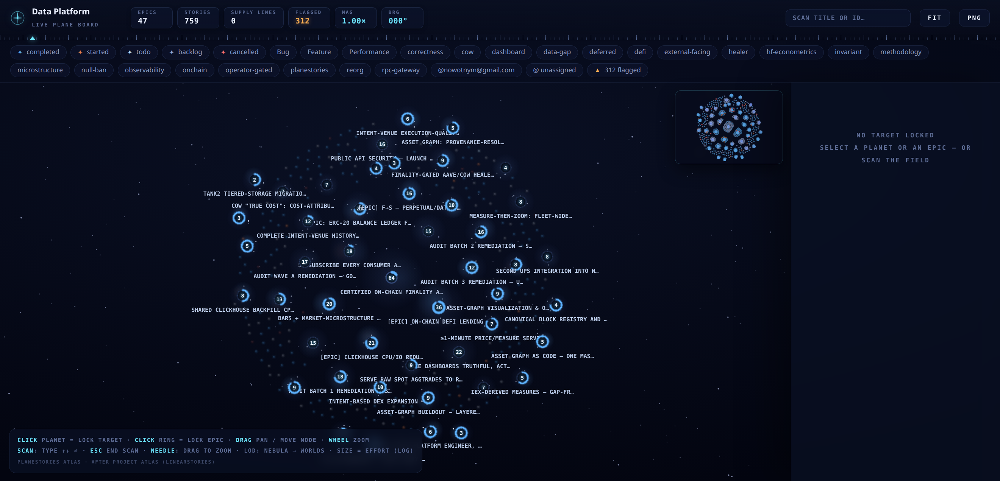
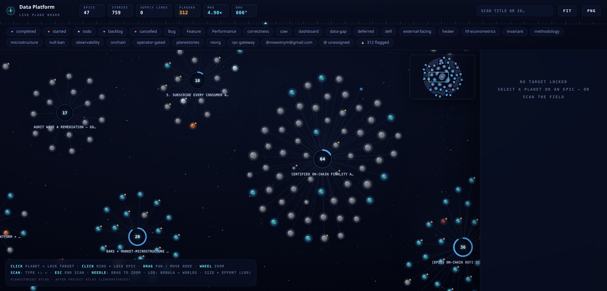
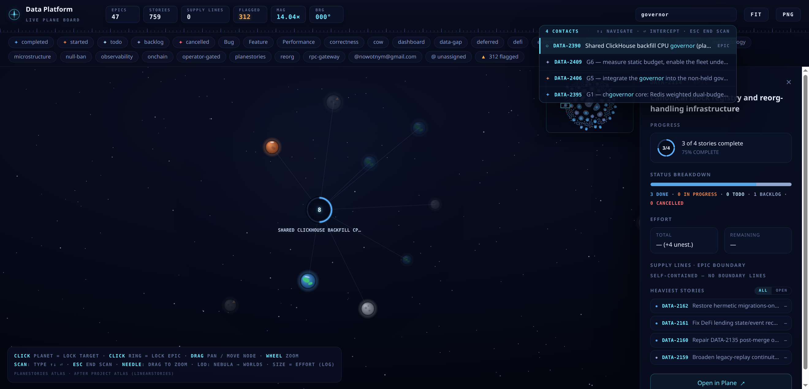
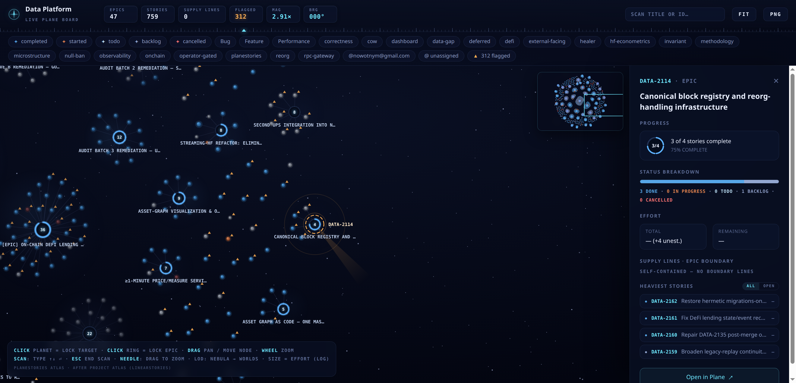

# planestories

[](https://www.npmjs.com/package/planestories)
[](./LICENSE)

**Your project board as code — with a navigator the whole organization can read.**

planestories bridges markdown user stories in your repository and [Plane](https://plane.so)
work items, in both directions. Stories are written, reviewed, and versioned like code;
the board stays current for everyone else. On top of that round-trip it adds a quality
toolchain (linting, board health checks, grooming), the **Project Atlas** — an interactive
map of your entire project that reads at every altitude from executive overview to a single
acceptance criterion — and a **replication engine** that migrates whole projects between
Plane deployments (cloud ↔ self-hosted) with exact ticket numbers preserved.

> **Attribution.** planestories is a fork of [**linearstories**](https://github.com/stackingturtles/linearstories) by **Ijonas Kisselbach / Stacking Turtles Ltd.**, adapted to target Plane instead of Linear. The original is MIT-licensed; that license is preserved in full (see [`LICENSE`](./LICENSE) and [`NOTICE`](./NOTICE)). Huge thanks to the original author.

## Executive summary

Most teams lose information in the gap between *where work is described* (the board) and
*where work happens* (the repository, the terminal, the agent). planestories closes that
gap and then makes the state of the whole project legible:

- **Stories as code.** User stories with checkbox acceptance criteria live in markdown,
  in git — reviewable in pull requests, greppable, diffable, and consumable by AI coding
  agents as deterministic specs. Imports are idempotent; exports are warm (unchanged
  stories cost zero writes); the board and the files converge instead of drifting.
- **Discipline that scales.** `lint` enforces story quality at authoring time; `doctor`
  detects board rot (orphaned criteria, duplicate titles, dangling dependencies) and
  works as a CI gate; `groom` cleans up after closed work; a rating skill scores story
  batches before refinement. The same guardrails serve a solo developer and a
  hundred-ticket program.
- **The Project Atlas** turns the board into a single interactive picture — epics as
  star systems, stories as planets whose color is status and size is effort, dependencies
  as supply lines. Managers read the constellation; tech leads read a cluster; a
  developer locks one planet and reads its acceptance criteria. One artifact, every
  altitude, no login required (it is a self-contained HTML file you can attach to an
  email).
- **Deployment freedom.** The replication engine snapshots a project into a versioned
  JSON file (which doubles as a full backup) and replays it onto any Plane instance —
  cloud to self-hosted Community Edition or back — preserving exact `PROJECT-N` ticket
  numbers, hierarchy, dependencies, comments, and (where the target accepts them) original
  timestamps and authorship. Verification is a first-class command, not a hope. Migrating
  hosting setups stops being infrastructure debt and becomes an afternoon experiment.

**Who it serves:** solo developers who want specs their AI agents can execute against;
small teams who want the board to maintain itself; large organizations that need one
truthful picture across dozens of epics; mixed human+AI teams where agents read, tick,
and update the same stories humans review; and non-engineering functions — marketing
launch plans, finance close checklists, operations runbooks are all "stories with
acceptance criteria" the moment you write them down.

## The Project Atlas

`planestories atlas --project "Data Platform" -o atlas.html` renders your live board (or
a stories file) into a **self-contained, offline HTML star map**. No server, no accounts —
open it in any browser, attach it to a status email, or publish it on an intranet.



**The overview is the executive read.** Every epic is a star system: the ring counts its
stories, the label names it, and the system's glow summarizes status at a glance. The
header strip gives the headline numbers (epics, stories, flagged items); the chip bar
filters by status, label, or assignee; the minimap keeps the whole galaxy in view. A
manager answers "where is the program heavy, where is it stuck?" in seconds, without
learning a PM tool.



**Zoom is level of detail.** The Atlas uses a telescopic LOD driven by real areal
spacing: from afar, clusters are nebulae; as you approach, they resolve into individual
worlds. Story color encodes the terraforming ladder — barren rock (backlog), ice (todo),
a reddening Mars (in progress), a living Earth (done), cinder (cancelled) — so a
cluster's mix of living and barren worlds IS its progress report. Planet size encodes
effort (log-scaled), orbits encode parent-child structure, and supply lines draw the
dependency graph across epic boundaries — the critical-path picture tech leads actually
need.



**SCAN is instant navigation.** Type any fragment of a title or ticket id and the field
dims to your matches with a keyboard-navigable contact list; hit intercept and the camera
flies to the target. It is the fastest "where is that ticket and what is around it?" in
the toolchain.



**Lock a target, read its dossier.** Selecting an epic opens its dossier: completion ring
and percentage, status breakdown, total and remaining effort, boundary supply lines
(what this epic blocks and is blocked by), and its heaviest open stories — with a direct
"Open in Plane" link. Selecting a single story shows its full card, including acceptance
criteria. Program review, sprint planning, and standup can all point at the same living
picture instead of three different dashboards.

For automation, `atlas --json` emits the identical graph (nodes, dependency edges,
effort, status, criteria) as machine-readable JSON — the HTML and your tooling can never
disagree. See [`docs/ATLAS.md`](docs/ATLAS.md) for the full design.

## Replicate projects between Plane deployments

The replication engine removes the biggest piece of PM-tool infrastructure debt: being
stuck where your data is.

```bash
# 1. One paced read -> a versioned, digest-bound snapshot (also a full backup)
planestories replicate snapshot --from cloud -p "Data Platform" -o data.snapshot.json

# 2. Replay onto any target -- zero source reads, dry-run by default, resumable
planestories replicate apply --to ce --snapshot data.snapshot.json --yes

# 3. Prove it, field by field
planestories replicate verify --to ce --snapshot data.snapshot.json
planestories replicate freshness --from cloud --snapshot data.snapshot.json --deep
```

- **Exact ticket numbers.** `PROJECT-123` stays `PROJECT-123` on the target — sequence
  gaps and all — so every reference in commit messages, documents, and story files stays
  meaningful. (Mechanism: serial creation with gap placeholders, validated against
  Plane's own sequence-ledger semantics, asserted on every create.)
- **Everything that matters travels:** hierarchy, dependencies of every kind, comments,
  states with colors, labels, priorities, dates, estimates — with original timestamps
  and authorship preserved natively where the target instance accepts them.
- **Crash-safe by construction.** Every write is journaled (fsync'd, locked); a killed
  run resumes exactly where it stopped; ambiguous writes are reconciled before any
  replay; a concurrent write to the target aborts the run rather than corrupting
  numbering. `verify` is a field-complete cutover gate and `freshness --deep` proves the
  source didn't drift since the snapshot. Honest degradation/loss manifests report
  anything a target cannot carry — nothing is silently dropped.
- **Cutover tooling included:** `replicate relink` rewrites your markdown corpus to the
  new instance's ids/URLs atomically; `rename-project` frees or renames identifiers.
- **Snapshots are backups.** A nightly `replicate snapshot` gives you versioned,
  restorable, diffable board backups for free.

Multi-instance work is first-class: named credential **contexts**
(`--context ce`, configured via `PLANE_CTX_<NAME>_*` env vars) keep cloud and
self-hosted credentials strictly separated, and the client speaks both Plane REST
dialects (`/issues/` and `/work-items/`), auto-selected per instance. See
[`docs/REPLICATE.md`](docs/REPLICATE.md).

## Quick start

### 1. Install

Run directly with `bunx` (no install required):

```bash
bunx planestories import stories/*.md
```

Or install globally / build a binary:

```bash
bun install -g planestories
# or build from source:
bun install
bun build src/cli/index.ts --compile --outfile planestories
```

### 2. Provide credentials (never commit them)

Credentials live in a **gitignored `.env`** file — never in a committed config. Copy `.env.example` to `.env` and fill in:

```bash
PLANE_API_KEY=plane_api_xxxxxxxxxxxxxxxxxxxx      # Plane > Profile Settings > Personal Access Tokens
PLANE_WORKSPACE_SLUG=your-workspace-slug          # the app.plane.so/<slug>/... part of your URL
# PLANE_BASE_URL=https://api.plane.so             # only override when self-hosting
```

### 3. Add non-secret defaults (optional)

Create `.planestoriesrc.json` in your project root for **non-secret** defaults. **Do not put `apiKey` here** — it comes from `.env`.

```json
{
  "workspaceSlug": "your-workspace-slug",
  "baseUrl": "https://api.plane.so",
  "defaultProject": "Q1 2026 Release",
  "defaultLabels": ["User Story"]
}
```

`PLANE_API_KEY`, `PLANE_WORKSPACE_SLUG`, `PLANE_BASE_URL`, and `PLANE_DIALECT` from the environment override
config-file values **when no `--context` is selected**. A **named context** (`--context ce`)
resolves only its own `PLANE_CTX_<NAME>_API_KEY` / `_WORKSPACE_SLUG` / `_BASE_URL` / `_DIALECT` variables —
the bare variables never apply to it, so working against two Plane instances (e.g. cloud +
self-hosted) can never cross credentials. A context may exist purely in the environment
(no config-file entry needed): setting `PLANE_CTX_CE_*` makes `--context ce` work as-is.
**Migration note:** if you previously relied on bare `PLANE_API_KEY` overriding a `--context`
selection, set `PLANE_CTX_<NAME>_API_KEY` instead.

### 4. Write your first story

Create `stories/login.md` (see [`templates/user-story.md`](./templates/user-story.md)):

````markdown
---
project: "Q1 2026 Release"
---

## As a user, I want to log in so that I can access my account

```yaml
plane_id:
plane_identifier:
plane_url:
priority: high
labels: [Feature, Auth]
estimate: 3
assignee: jane@company.com
status: Backlog
```

User should be able to log in with their email and password.

### Acceptance Criteria

- [ ] User can enter email and password on the login page
- [ ] Invalid credentials show a clear error message
````

### 5. Import

```bash
planestories import stories/*.md            # create/update work items, write ids back
planestories import stories/*.md --dry-run  # preview: reports exactly what apply would do, no writes
```

`--dry-run` is **faithful** — it consults the board read-only (one memoized listing) and reports the same per-story outcome apply would produce (`would create` / `would update` / `unchanged` / `would skip` a duplicate) — it just never writes. Add `--check` to also validate that each `status` / `assignee` / `label` / `parent` resolves.

After a successful import, `plane_id` (the work item UUID), `plane_identifier` (e.g. `ENG-42`), and `plane_url` are written back into each story's YAML block.

## How fields map to Plane

| Story field | Plane |
|---|---|
| `project` (per-story / frontmatter / `--project`) | the work item's **project** (required — Plane has no "team" tier) |
| `## Heading` | work item name |
| body markdown | `description_html` (converted to HTML) |
| `priority` | `urgent` / `high` / `medium` / `low` / `none` (legacy Linear integers `0–4` are also accepted) |
| `status` | work item **state** (resolved by name within the project) |
| `labels` | label UUIDs (resolved by name within the project) |
| `assignee` | member UUID (resolved by email or display name) |
| `estimate` | story `point` |
| `plane_id` | work item UUID (used to update) |
| `plane_hash` | content hash of the last sync (auto-managed) — powers skip-unchanged |
| `parent` | nests this item under an existing one (`parent: DATA-12`; resolved by identifier) |
| `kind` | `story` / `criterion` / `epic` — informational; emitted by export, read on import |
| `comment` | optional evidence note posted once (idempotently) on create/update/status change |

### Choosing the project

A workspace usually has several projects. You can target any of them at three levels of
granularity (highest precedence first):

1. **`--project "Name"`** on the command — forces *all* stories in that run into one project.
2. **Per-story `project:`** in a story's YAML block — routes that single story.
3. **File frontmatter `project:`** — the default for every story in the file.
4. **`defaultProject`** in config — the fallback when nothing else is set.

So one file can fan stories out to different projects:

````markdown
---
project: "True Cost"          # file default
---

## A story that goes to Infrastructure Setup

```yaml
project: Infrastructure Setup  # per-story override
```
...

## A story that uses the file default (True Cost)
...
````

A project can be given by its **display name** ("Infrastructure Setup") or its **identifier**
("INFRASETUP" — stable and typo-resistant). Run `planestories projects` to list both for your
workspace. An unknown name fails loudly and suggests the closest match plus the available list
(`Project not found: "Infrastructure". Did you mean "Infrastructure Setup"? Available projects: ...`).
Use `--dry-run --check` to validate routing before importing.

### Idempotency, skip-unchanged & duplicates

On create, planestories stamps each work item with `external_id` (derived from the story title) and `external_source: "planestories"`, then writes `plane_id` back into the file. Re-running the import updates that item **by its `plane_id`** — never duplicating. A story that has **no** `plane_id` but whose title matches an existing item is treated as a duplicate (see below), so a second file can't silently overwrite the first file's work item — link it explicitly with `--adopt-duplicates` (or add the `plane_id`) when that's what you intend.

- **Skip-unchanged.** Each synced story stores a `plane_hash` (a hash of the rendered payload). On re-import, a linked story whose content is unchanged is reported `unchanged` and makes **zero API writes** — so re-importing a large, mostly-static board is cheap. Cosmetic markdown reflow that renders to the same HTML doesn't count as a change. `--force` re-imports regardless. (An edit made in the Plane UI while the file is untouched is intentionally not pulled back by import — that's a future `groom` reverse-sync's job.)
- **Warm export → import.** `export` writes `plane_hash` too, so re-importing an unedited exported file is all-`unchanged` (no blind description rewrites). For files that carry a `plane_id` but no `plane_hash` (legacy or hand-authored), import reconstructs the board item from a single project listing and adopts the hash if the content already matches — one list call, never a per-item fetch.
- **Duplicate guard.** Before creating a brand-new story, planestories checks whether an item with the **exact same title** already exists in the project (created by anyone). By default it **skips with a warning** (`duplicate of ENG-42 (Backlog)`), so you never get accidental twins. Pass `--adopt-duplicates` to link a single exact match instead (multiple matches are a hard error — set `plane_id` manually), or `--force-create` to create anyway.

### Identifying planestories items

Every created work item is stamped with `external_source: "planestories"` — that's how
`delete`/`export --external-source` and idempotent matching find them. That field is an
API field, though, and isn't shown in Plane's normal board views. If you also want a
**visible** marker, set a **source label** (opt-in, off by default): `sourceLabel` in
config, `PLANE_SOURCE_LABEL` in the environment, or `--source-label <name>` per run. When
set, every created item is tagged with that label (auto-created — no `--create-labels`
needed), so humans can see and filter "what came from planestories" in the Plane UI.

### Missing labels

By default, labels that don't exist in the project are **skipped with a warning** (deduped, one line per label). Pass `--create-labels` to create them instead.

### Acceptance criteria as sub-items (`--sync-criteria`)

By default a story's `### Acceptance Criteria` checklist is stored in the work item's description. Pass `--sync-criteria` to instead sync **each criterion to a Plane sub-item** (a child work item). A `- [x]` maps to a completed-group state and `- [ ]` to an open state, so ticking a box in markdown moves the sub-item — and `export --sync-criteria` reconstructs the checklist from the sub-items' states. The mapping is idempotent (keyed per criterion), so re-imports update in place.

## Commands

### `import`

```
planestories import <files...> [options]
  -c, --config <path>     Config file path
  --context <name>        Select a named context from a multi-context config
  -p, --project <name>    Force all stories into this project (overrides frontmatter)
  --create-labels         Create labels that don't exist instead of skipping
  --source-label <name>   Tag every created item with this label (auto-created)
  --sync-criteria         Sync each acceptance criterion to a Plane sub-item
  --status-only           Update ONLY the state of already-linked items (skip unlinked)
  --force                 Re-import even when content is unchanged (bypass skip-unchanged)
  --adopt-duplicates      Link a single exact-title match instead of skipping it
  --force-create          Create even when a same-title item exists (bypass the duplicate guard)
  --strict                Refuse headings with no YAML block and no acceptance criteria
  --dry-run               Preview without writing to Plane
  --check                 With --dry-run, validate read-only (project/state/assignee/labels)
  --no-write-back         Skip writing Plane ids back into the markdown
```

`--status-only` is the mode for bulk state transitions (e.g. closing a batch of tickets): for every story that already has a `plane_id` it PATCHes only the `state` (from `status:`) and touches nothing else — no description re-render, no title/label clobber. Unlinked stories are skipped with a warning.

### `export`

```
planestories export [options]
  -o, --output <file>       Output file (default ./exported-stories.md)
  -p, --project <name>      Project to export from (required if no defaultProject)
  -i, --issues <ids>        Comma-separated work item identifiers (e.g. ENG-8)
  -s, --status <state>      Filter by status (repeatable — keeps items matching any)
  --open-only               Only export open items (backlog/unstarted/started)
  -a, --assignee <email>    Filter by assignee email
  -l, --label <name>        Filter by label name
  --external-source [src]   Only export items planestories created (default: planestories)
  --sync-criteria           Reconstruct acceptance criteria from sub-items
  --include-archived        Include items carrying the 'archived' label (excluded by default)
```

Export converts Plane's HTML description back to markdown (headings and `- [ ]`/`- [x]` checklists survive a round-trip), and emits stories in ascending identifier order. It also emits `parent`/`kind` structure and writes `plane_hash`, so re-importing an unedited exported file is all-`unchanged` (see [Idempotency, skip-unchanged & duplicates](#idempotency-skip-unchanged--duplicates)).

### `projects`

List the projects in your workspace (identifier + name) — handy for first-run setup and for
choosing the right `--project` value.

```
planestories projects
```

### `set`

Update fields on existing work items by identifier — handy for moving a card without editing YAML.

```
planestories set <identifiers...> [options]   # e.g. set ENG-12 ENG-13 --status "In Progress"
  -p, --project <name>    Project (required if no defaultProject)
  -s, --status <state>    Set the state by name
  --priority <level>      urgent | high | medium | low | none
  -a, --assignee <email>  Set the assignee by email
```

### `delete`

Delete (or archive) work items — **scoped only**, never a blunt project wipe. Either by the files' `plane_id`s (which clears `plane_*` back out as the inverse of import) or by `external_source` within a project.

```
planestories delete <files...> [options]
planestories delete --external-source [src] --project <name> [options]
  --archive               Archive instead of hard delete (applies an 'archived' label)
  --archive-label <name>  Label to apply when archiving (default: archived)
  --dry-run               Show what would be deleted, change nothing
  -y, --yes               Confirm deletion (required — without it, only the plan is shown)
  --no-write-back         Don't clear plane_* out of files after deletion
```

**Archiving** uses a label, not Plane's native archive (which is restricted to
completed/cancelled items). `delete --archive` applies the `archived` label (recoverable —
just remove the label; works on any state) and leaves the work item in place. Archived
items are excluded from `export` by default (pass `--include-archived` to see them).

### `groom`

Reconcile a project (dry-run by default; `--yes` to apply). Keeps a board tidy as work
completes on it:

```
planestories groom --project <name> [--yes]
```

- **Closes orphaned criterion sub-items** — an open `--sync-criteria` sub-item whose parent
  is Done/Cancelled is moved to a completed state, with an idempotent "auto-closed with parent"
  comment. **Only planestories criterion sub-items are ever closed** — a real child *story* of
  a done epic is never touched.
- **Reports** duplicate-title work items and criterion sub-items whose parent no longer exists.

### `doctor`

A read-only CI health check over the same analysis — prints board rot and **exits non-zero on
findings** (pass `--no-fail-on-findings` to just report):

```
planestories doctor --project <name>
```

### `lint`

An **offline, mechanical** pre-import check over one or more story files — no Plane API, no credentials.
Exits non-zero on any violation, so you can gate CI on it before importing:

```
planestories lint stories/*.md              # strict by default: any error fails (exit 1)
planestories lint stories/*.md --warn-only  # report only, always exit 0 (gradual adoption)
```

Lint is strict by default; use `--warn-only` to downgrade all violations to warnings. It enforces the
house conventions across the passed fileset (cross-file aware): every non-epic story has
acceptance criteria (inline or a criterion child) **and** an effort value; every epic has a
`### Why is this needed?` section and no acceptance criteria; dependencies are well-formed (no cycles, no
self-references; identifiers not in the fileset are flagged as *warnings* since they may live on the
board); Plane identifiers are unique; no criteria are orphaned; and `parent:` targets resolve to an epic.
It complements — does not duplicate — `doctor` (board-side) and the `/rate-userstories` skill (LLM
grading).

### `atlas`

Render an interactive **Project Atlas** — a single self-contained HTML file (no server, no CDN, works
offline) that lays your epics, stories, and acceptance criteria out as a tidy tree you can pan, zoom,
filter, and search. Point it at a stories file *or* a live Plane project:

```
planestories atlas stories/q1-2026.md -o atlas.html --open   # from a file (offline)
planestories atlas --project "Data Platform" -o atlas.html   # from the live board
```

Every node shows its status colour, an acceptance-criteria completion ring, and a spec-quality flag;
click one for a details panel with its criteria, labels, and a deep link back to Plane. Filter chips
narrow by status group, label, or "flagged only" (which prunes to the flagged stories while keeping
their parent epics as context). Light/dark theme follows your OS and has a manual toggle. Open the
file in any browser — nothing is uploaded anywhere. See [docs/ATLAS.md](./docs/ATLAS.md).

> Inspired by Ijonas Kisselbach's Project Atlas in linearstories, rethought for Plane and shipped as a
> zero-dependency offline artifact.

## Rating story quality — `/rate-userstories`

planestories ships a Claude Code skill that reviews a story file *before* you import it. Run it in any Claude Code session:

```
/rate-userstories stories/q1-2026.md
```

It classifies each issue (epic / user story), validates structure and epic→child hierarchy, scores each with a type-specific rubric (epics get their own goal-clarity / scope / rationale rubric), and — critically for agentic coding — detects contradictions within and across issues, emitting corrected replacement markdown you can review. Vague, unfalsifiable, or self-contradicting acceptance criteria fail with concrete rewrites. It reads both inline `### Acceptance Criteria` and exported `kind: criterion` sub-items. Full reference: [docs/RATE_USERSTORIES.md](./docs/RATE_USERSTORIES.md).

> Adapted from linearstories' `/rate-userstories` skill; the epic-aware upgrade follows an enhancement by Ijonas Kisselbach.

## Reliability

Every Plane API call retries transient failures automatically — HTTP 429 (honoring `Retry-After`), 5xx, and network blips — with exponential backoff plus jitter (capped at 30s). So a large bulk import or close won't fall over on a rate limit. Tune the retry budget with `PLANE_MAX_RETRIES` (default `5`; `0` disables). After the retries are exhausted the error surfaces, and per-story failures never abort the run — the summary lists the failed items.

## Self-hosting

planestories works against Plane Cloud by default (`https://api.plane.so`). To target a self-hosted instance, set `PLANE_BASE_URL` (env) or `baseUrl` (config) to your instance URL — no code changes required.

## Multiple workspaces (contexts)

A config file may define named contexts; select one with `--context <name>`:

```json
{
  "contexts": [
    { "name": "orgA", "workspaceSlug": "org-a", "defaultProject": "Q1 Release" },
    { "name": "orgB", "workspaceSlug": "org-b", "defaultProject": "Brand Refresh" }
  ]
}
```

Set optional `dialect` to `"work-items"` (or `PLANE_CTX_<NAME>_DIALECT=work-items`) when a
self-hosted Plane instance serves dependency relations under `/work-items/`. It defaults to
`"issues"`; a present value other than those two choices is rejected.

## Development

```bash
bun install
bun test            # run the test suite
bun run lint        # biome
```

## License

MIT. See [`LICENSE`](./LICENSE) (original © Stacking Turtles Ltd.) and [`NOTICE`](./NOTICE) for attribution and modification copyright.
